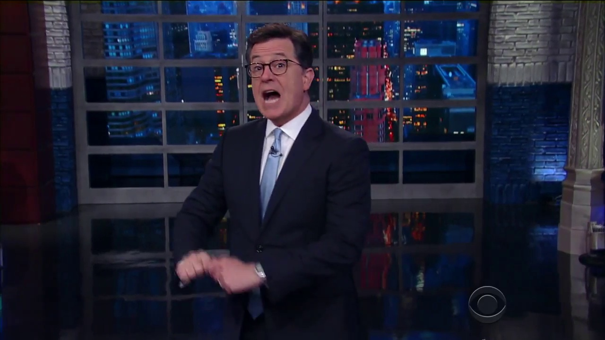
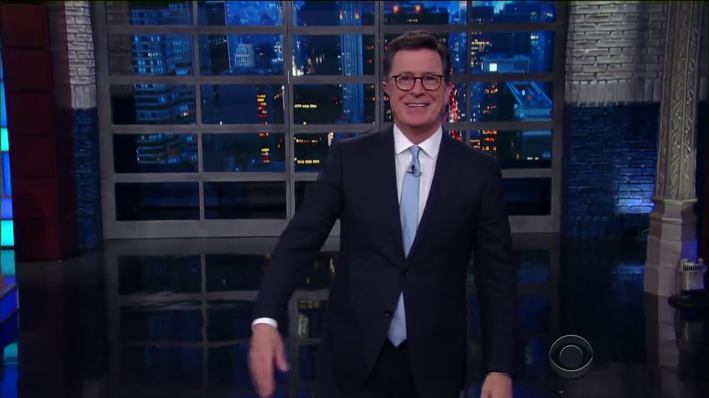

# YouTube Meme image generator

### Generates a base image for you to build meme's on

#### Uses opencv(for face detection), pytube(to download the youtube video), Microsoft Congnitive Emotion API (to tag images with emotions)

Check the comments on the code to understand about it

### Example:
Example code to pull reaction faces from youtube video 'Donald Trump Lets Jimmy Fallon Mess Up His Hair' from the youtube channel: The Tonight Show Starring Jimmy Fallon.

    python yt_reaction_faces.py  -y https://www.youtube.com/watch?v=u0BYqzdiuJc -o example_output -m 200
    
  * arguments used:
    - `-y` : youtube video's url
    - `-o` : reaction face output directory
    - `-m` : max frames to examine (starts at begining of video; assumes ~60 fps)

### Example output:

#### Surprise:

#### Contempt:

#### Happiness:

